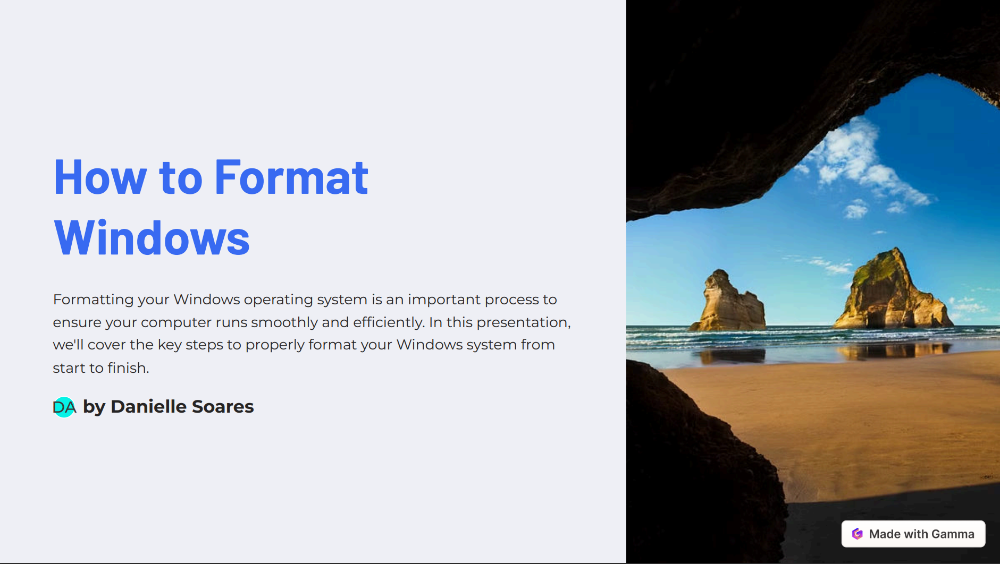

# How to Format Windows Presentation

## 📒 Descrição
Os slides sobre "Como formatar o Windows" foram gerados por meio de Inteligência Artificial (IA). 

## 🤖 Tecnologias Utilizadas
* **Gamma.app**: Feito para gerar os slides por meio de um prompt.

## 🧐 Processo de Criação
Para obter obter os slides, escrevi um prompt que descrevia o que a IA faria. A fim de obter um melhor resultado, escrevi o promp em inglês. 

| ação | descrição |
|------|-----------|
| prompt| "create a presentation of the topic "How to format windows". Use simple, direct language and make around 8 slides."|
## 🚀 Resultados
Para acessar os slides, acesse a pasta 'presentation' e busque pelo arquivo em PDF.

**Preview**:

